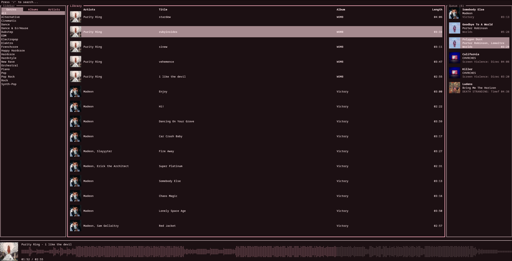

# refrain

### A fast, lightweight and modern terminal music for Linux.

Built with Rust and Ratatui.

<br />



<br />

> **Status: Active Work In Progress**
> refrain is currently in early development. Features, keybindings and configuration may change.

## Features (marked have been finished)
- [x] Cover art display - displays cover art of all songs in the list
- [x] Audio waveform - shows a seekbar in the form of an audio waveform, powered by [`audio-waveform`](https://github.com/s1nn3rv2/audio-waveform)
- [x] Fuzzy search - fuzzy-search powered by [`nucleo-matcher`](https://github.com/helix-editor/nucleo) 
- [x] Extremely fast - scanning 1800+ songs takes less than a second, covers load on demand
- [ ] Tag editing - allows you to edit tags on songs
- [ ] MPRIS support - allows you to control and see the current song in your system's media player 
- [ ] Queue management
- [ ] Context-aware shuffle - knows your context, whether you're in an album, genre or everything, it knows what songs to pick from
- [ ] Synced lyrics - see automatically fetches and scrolls lyrics 
- [ ] Gapless playback - seamless track transitions
- [ ] Extensible config support - allows you to adjust the player to your liking 

## Keybindings

| Key | Action |
|:---|:---|
| `j` / `Down` | Move down |
| `k` / `Up` | Move up |
| `Enter` / `l` | Play selected track |
| `p` | Play / Pause |
| `/` | Open fuzzy search |
| `r` | Rescan `~/Music` directory |
| `Esc` / `Enter` | Exit search mode |
| `q` | Quit |

---

## Why not rmpc?
Rmpc is a really good option as well! But I missed having cover arts displayed on every song. At first I thought it was just a limitation of TUI apps, but after seeing [concord](https://github.com/chojs23/concord) I realized it's possible! I also wanted a workflow that I had when I was using foobar2000 back on Windows, where I also could edit tags of songs directly from the app. Despite me making this app mainly for myself, I do want to add a lot of customization options for it to be adjustable by the user as well!

## Uses
- **TUI:** [Ratatui](https://github.com/ratatui/ratatui) & [Crossterm](https://github.com/crossterm-rs/crossterm)
- **Audio playback:** [Rodio](https://github.com/RustAudio/rodio)
- **Tag extraction:** [Lofty](https://github.com/Serial-ATA/lofty-rs)
- **Waveforms:** [audio-waveform](https://github.com/s1nn3rv2/audio-waveform) 
- **Image support:** [ratatui-image](https://github.com/benjajaja/ratatui-image)
- **Fuzzy search:** [nucleo-matcher](https://github.com/helix-editor/nucleo)

## Build & Run

```bash
# Clone the repository
git clone https://github.com/s1nn3rv2/refrain.git
cd refrain

# Run in release mode (it is WAY faster in release mode)
cargo run --release
```

## Contributing

Contributions, bug reports and feature ideas are very welcome!

## License

Licensed under the MIT License (LICENSE-MIT or http://opensource.org/licenses/MIT). 
